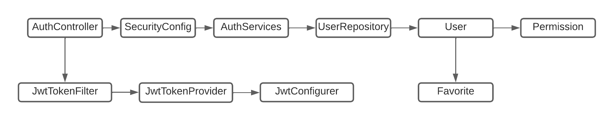
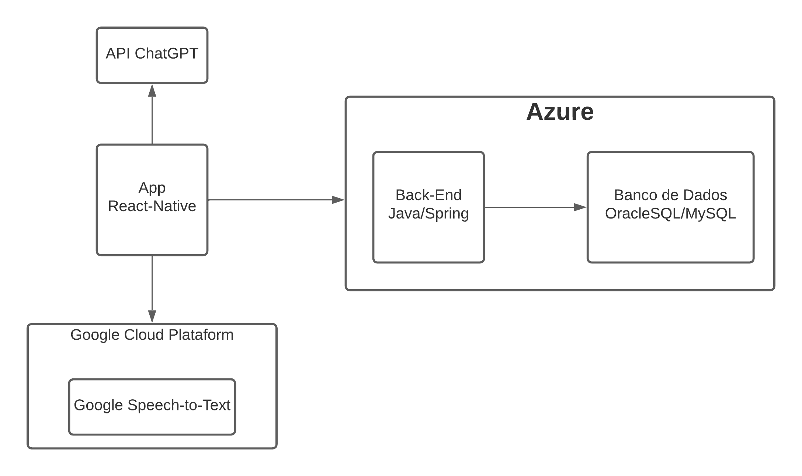

<h1>API Challenge NextIdea - Sprint 2</h1>

<h2>Para Teste</h2>
<p>Caso deseje testar a aplicação, o usuário que já existe no banco é:</p>

```json
  {
    "username": "sprint",
    "password": "admin123"
  }
```

<h2>Objetivo</h2>
<p>O objetivo da aplicação é utilizar o chatGPT para 
aprimorar a expêriencia do usuário na busca e descoberta 
de produtos. O chatGPT irá funcionar como um 
assistente pessoal de compras que irá abstrair os termos 
complexos dos produtos tornando-os de fácil compreensão para
usuários leigos.</p>

<h2>Escopo</h2>
<p>Para tornar está solução realidade, o projeto irá utilizar</p>
<ul>
    <li>Uma API back-end escrita em Java, resposável pela autenticação e operações do 
        usuário, tais como: login, cadastro, desativar conta,
        adicionar favorito, editar favorito e remover favorito
    </li>
    <li>Um banco de dados relacional, OracleSQL/MySQL, para armazenar
        os dados de persistêcia do usuário, tais como conta e favoritos.
    </li>
    <li>Uma interface front-end que irá consumir a API e ao mesmo 
        tempo consumir a API do chatGPT para realizar as pesquisas.
        Este front-end será um aplicativo mobile construido em 
        react-native e contará com a funcionalidade de STT (Speech-to-Text)
        e TTS (Text-to-Speech).
    </li>
</ul>

<h2>Arquitetura da Solução</h2>



<table>
    <tr>
        <td>Componente</td>
        <td>Descrição</td>
    </tr>
    <tr>
        <td>AuthController</td>
        <td>Expõe os endpoints correspondente a cada serviço contido no AuthServices. Se comunica com AuthServices.</td>
    </tr>
    <tr>
        <td>SecurityConfig</td>
        <td>Responsável pelas configurações de segurança, toda requisição que o AuthController recebe, passa por este arquivo de configuração.</td>
    </tr>
    <tr>
        <td>AuthServices</td>
        <td>Faz as operações do usuário incluindo a autenticação. Se comunica com UserRepository e com AuthController.</td>
    </tr>
    <tr>
        <td>UserRepository</td>
        <td>Faz as operações do usuário no banco de dados. Se comunica com AuthServices.</td>
    </tr>
    <tr>
        <td>User</td>
        <td>Representa a tabela de Usuários do banco de dados. Se comunica com Permission numa relação de muitos pra muitos e com também se comunica com Favorite em uma relação de um para muitos.</td>
    </tr>
    <tr>
        <td>Permission</td>
        <td>Representa a tabela de Permissões do banco de dados.</td>
    </tr>
    <tr>
        <td>Favorite</td>
        <td>Representa a tabela de Favorito do banco de dados.</td>
    </tr>
    <tr>
        <td>JwtTokenFilter</td>
        <td>Resposável por filtrar e validar se o token é valido. Se comunica com o JwtTokenProvider.</td>
    </tr>
    <tr>
        <td>JwtTokenProvider</td>
        <td>Faz as operações do JWT token, como validar token e gerar token.</td>
    </tr>
    <tr>
        <td>JwtConfigurer</td>
        <td>Faz as configurações do JWT. Se comunica com o JwtTokenProvider,</td>
    </tr>
</table>

<h2>Arquitetura da Solução - Macro</h2>



<h3>Tecnologias</h3>
<ul>
    <li>Java | Spring Framework</li>
    <li>React Native</li>
    <li>Expo</li>
    <li>Google Cloud Plataform | Google Speech to Text API</li>
    <li>Banco de Dados Oracle | MySQL</li>
    <li>Azure</li>
    <li>API ChatGPT</li>
</ul>

<h2>Endpoints</h2>
<table>
    <tr>
        <td>method</td>
        <td>path</td>
        <td>body</td>
        <td>status codes</td>
    </tr>
    <tr>
        <td>POST</td>
        <td>/auth/signin</td>
        <td>
            <code>
            {<br/>
                "username":string, 
                "password":string<br/>
            }
            </code>
        </td>
        <td>200, 400, 403, 500</td>
    </tr>
    <tr>
        <td>POST</td>
        <td>/auth/signup</td>
        <td>
            <code>
            { <br/>
              "name": "string", <br/>
              "email": "string", <br/>
              "password": "string" <br/>
            }
            </code>
        </td>
        <td>200, 400, 401, 403, 500</td>
    </tr>
    <tr>
        <td>DELETE</td>
        <td>/auth/delete</td>
        <td>
            <code>
            { 
                "username": "string", <br/>
                "password": "string"
            }
            </code>
        </td>
        <td>200, 400, 401, 403, 404, 500</td>
    </tr>
    <tr>
        <td>GET</td>
        <td>/favorite</td>
        <td>
        </td>
        <td>200, 400, 401, 403, 404, 500</td>
    </tr>
    <tr>
        <td>POST</td>
        <td>/favorite</td>
        <td>
            <code>
            { <br/>
                "idUser": "numeric", <br/>
                "name": "string", <br/>
                "url": "string" <br/>
            }
            </code>
        </td>
        <td>200, 400, 401, 403, 404, 500</td>
    </tr>
    <tr>
        <td>DELETE</td>
        <td>/favorite</td>
        <td>
            <code>
            { <br/>
                "idUser": "numeric", <br/>
                "idFavorite": "numeric", <br/>
            }
            </code>
        </td>
        <td>200, 400, 401, 403, 404, 500</td>
    </tr>
</table>


